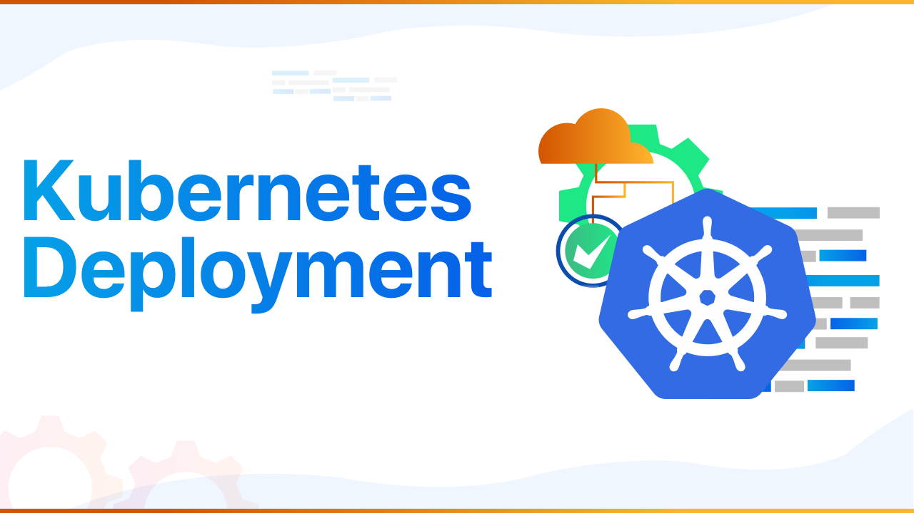

# DevOps Kubernetes Deployment
A hands-on DevOps project demonstrating how to containerize a Node.js application and deploy it to a Kubernetes cluster using Minikube. The project showcases container orchestration, service exposure, and horizontal scaling.

# Project Overview

This project simulates a simple production-style Kubernetes deployment. A Node.js application is containerized using Docker and deployed into a Kubernetes cluster. The application is exposed through a Kubernetes Service, allowing external access via Minikube.

The project also demonstrates how Kubernetes manages multiple pods and how deployments can be scaled dynamically.
 
# Architecture
    User (Browser)
            ↓
    Kubernetes Service (NodePort)
            ↓
    Pods running Node.js Application

# Workflow:
    1. Application is containerized using Docker
    2. Image is loaded into the local Kubernetes cluster
    3. Deployment creates multiple pods
    4. Service exposes the application
    5. Kubernetes distributes traffic across pods

# Project Structure

devops-kubernetes-deployment/  
app/  
 ├── app.js 
 ├── package.json 
 └── Dockerfile 
k8s/ 
 ├── deployment.yaml 
 └── service.yaml 
README.md

# Tools Used

Containerization 
    • Docker

Container Orchestration 
    • Kubernetes

Local Kubernetes Cluster 
    • Minikube

Cluster Management 
    • kubectl

# Application
The application is a simple Node.js HTTP server.

<h3>Example response:</h3>

    Hello from Kubernetes DevOps Project

The container exposes port 3000, which Kubernetes routes through the service.

# Deployment Workflow

Start Kubernetes Cluster:

    minikube start

Verify cluster status:

    kubectl get nodes
    Build Docker Image
    docker build -t devops-k8s-app:v1 .

Verify image:

    docker images
    Load Image into Minikube
    minikube image load devops-k8s-app:v1

Verify image inside cluster:

    minikube image ls
    Deploy Application
    kubectl apply -f deployment.yaml

Check pods:

    kubectl get pods
    Expose Application
    kubectl apply -f service.yaml

Verify service:

    kubectl get services

Access application:

    minikube service devops-service
    Scaling the Application

Kubernetes allows horizontal scaling by increasing the number of running pods.

Example scaling command:

    kubectl scale deployment devops-app --replicas=10

Verify scaling:

    kubectl get pods

Kubernetes automatically distributes traffic between running pods.

# Screenshots

Minikube Cluster Start

#
Docker Image Build

#
Docker Images

#
Image Loaded into Minikube

#
Kubernetes Apply Deployment

#
Scaling Demonstration & Kubernetes Pods After Scaling

#
Kubernetes Apply Service

#
Kubernetes Get Service

#
Service Verification & Application Access

#
Browser Output

#
<h3>Cleanup</h3>

<h3>Destroy the Kubernetes cluster:</h3>

minikube delete

#
Remove unused Docker resources:
    
    docker system prune -a
    docker volume prune
    docker builder prune
    docker system prune -a

Clean Docker images

#
Optional deep cleaning for Docker

#

# What This Project Demonstrates:

    • Containerizing applications using Docker
    • Deploying containers to Kubernetes
    • Creating Kubernetes Deployments
    • Exposing services using NodePort
    • Scaling applications horizontally
    • Managing containers within a cluster

# Future Improvements:

<h2> Potential enhancements for this project:</h2>

    • Integrate CI/CD deployment using GitHub Actions
    • Push Docker images to a container registry
    • Deploy on a cloud Kubernetes cluster (EKS or GKE)
    • Add monitoring using Prometheus and Grafana
